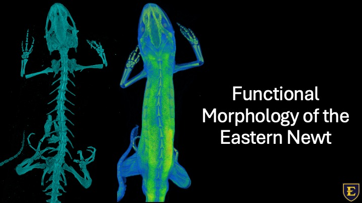

<section class="hero">
  

    
    

      <h1>Aaron J. Hardgrave</h1>
      
PhD Candidate in Biomedical Sciences

      
East Tennessee State University – Quillen College of Medicine

      
Expected graduation: Spring 2026

      

        <a href="mailto:Hardgrave@etsu.edu" class="btn btn-primary">Email Me</a>
        <a href="files/Hardgrave_Aaron_CV_Research_2026.pdf" class="btn btn-outline">Download CV</a>
      

    

  

</section>

## About Me

I study how animal form relates to function using advanced imaging and 3D morphometrics. My dissertation investigates skeletal and muscular adaptations in Eastern newts (*Notophthalmus viridescens*) as they transition between aquatic and terrestrial environments — work that informs broader questions about vertebrate evolution and biomechanics.

I'm equally passionate about anatomy education, teaching medical students, health sciences students, and undergraduates to think anatomically rather than simply memorize structures.

### Research Interests

<ul class="interest-tags">
  <li>Comparative Anatomy</li>
  <li>Functional Morphology</li>
  <li>Biomechanics</li>
  <li>µCT Imaging</li>
  <li>3D Geometric Morphometrics</li>
  <li>Anatomy Education</li>
</ul>

---

  

    <h3>Research</h3>
    
Dissertation research on Eastern newt functional morphology, publications, conference presentations, and imaging media.

    <a href="research/" class="card-link">View Research &rarr;</a>
  

  

    <h3>Teaching</h3>
    
Anatomy instruction across medical, health sciences, and undergraduate programs with emphasis on functional understanding.

    <a href="teaching/" class="card-link">View Teaching &rarr;</a>
  

  

    <h3>CV &amp; Contact</h3>
    
Full curriculum vitae, professional profiles, technical skills, and contact information.

    <a href="cv/" class="card-link">View CV &rarr;</a>
  

---

## Featured Research

  
  
Eastern newt volume renderings: osteological elements (left) and diceCT soft tissue capture (right)

**How does a newt's body shape change as it moves between water and land?**

Eastern newts live in water as juveniles, move onto land as young adults, and then return to water to reproduce. My research uses micro-CT scanning and geometric morphometrics to measure exactly how the vertebral column, limbs, and muscles differ between aquatic and terrestrial stages — revealing how skeletal form adapts to the demands of different environments.

  <video controls>
    <source src="images/Hindlimb_dice_animation.mp4" type="video/mp4">
    Your browser does not support the video tag.
  </video>
  
Slice-by-slice visualization of eastern newt hindlimb musculature captured using diceCT imaging

